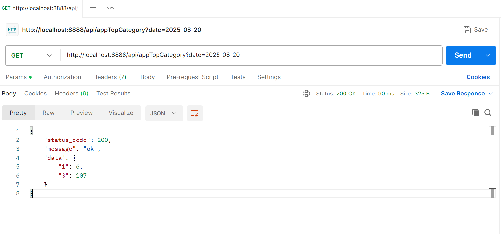
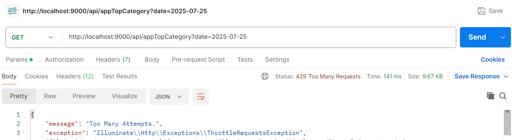
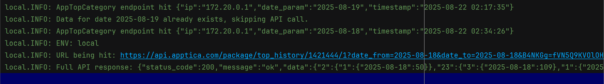
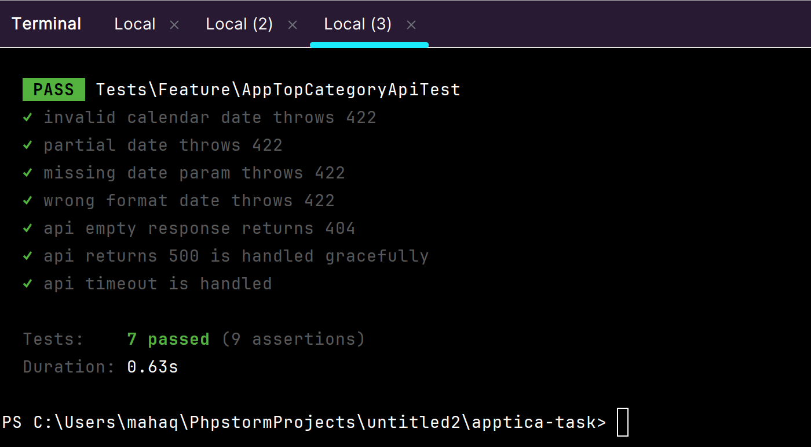

# Apptica Top Category API

API-сервис на Laravel, который получает, обрабатывает и сохраняет лучшие позиции приложения по категориям с сервиса Apptica. Решение реализовано как тестовое задание для позиции Backend-разработчика с соблюдением MVC-архитектуры и лучших практик Laravel.

---

## 📌 Описание

Сервис подключается к API Apptica и получает топ-позиции приложения (app_id = 1421444) по различным категориям на заданную дату. В базу данных сохраняется только лучшая (наименьшая) позиция по каждой категории. Результат можно получить через endpoint в виде JSON.

---

## 🚀 Функциональность

- Получение топ-позиций с API Apptica (по дате)

- Возвращает наименьшую позицию в каждой категории

- Предотвращение дубликатов через firstOrCreate

- Проверка входной даты строго в формате YYYY-MM-DD

- Обработка пустых, некорректных и ошибочных ответов API

- Пропуск API-запроса, если данные уже есть в БД

- **Бонус**: Ограничение количества запросов — 5 в минуту с одного IP

- **Бонус**: Логирование каждого запроса (IP, дата, таймстемп)

- **Бонус**: полная поддержка Docker с настройкой Nginx, PHP-FPM и MySQL
---

## ✅ Пример запроса

**GET** `/api/appTopCategory?date=2025-08-18`

**Response:**

```json
{
  "status_code": 200,
  "message": "ok",
  "data": {
    "1": 50,
    "3": 109,
    "9": 64
  }
}
```

*(where "2" and "23" are category IDs and values are best positions)*

📷 

---

## 🧪 Валидация и обработка ошибок

| Case                        | Status Code | Message |
|-----------------------------|-------------|---------|
| Valid date                 | 200         | ok |
| Invalid date (`2025-06-31`) | 422         | Validation error |
| Date missing                | 422         | Validation error |
| API returns no data         | 200         | "No data found" (logged) |
| API 500 / timeout           | 500         | Error logged, fallback response |
| More than 5 requests/min    | 429         | Throttle exception |

---

⚙️ Инструкция по запуску без Docker

1. Клонируйте репозиторий

2. Создайте файл .env на основе .env.example

3. Выполните миграции:

```bash
php artisan migrate
```
4. Запустите локальный сервер:

```bash
php artisan serve --port=8888
```
5. Перейдите по адресу:

```
http://localhost:8888/api/appTopCategory?date=2025-08-18
```


---
🐳 Docker (бонус)

Проект включает Docker-настройку для лёгкого локального запуска без необходимости устанавливать PHP или MySQL на систему.

Шаги запуска

1. Скопируйте .env.docker в .env:
```bash
cp .env.docker .env
```
2. Постройте и запустите контейнеры:
```bash
docker compose up -d
```
3. Откройте API в браузере или Postman:
```bash
http://localhost:9000/api/appTopCategory?date=2025-08-18

```

---


## 🧩 Бонус: Ограничение частоты запросов

### 1. Включено ограничение: 5 запросов в минуту на IP с использованием middleware Laravel.


```json
{
  "message": "Too Many Attempts."
}
```


---

### 2. Логирование

Каждое обращение к endpoint логируется (IP, параметр даты, время):

```
[2025-08-21 04:01:21] local.INFO: AppTopCategory endpoint hit {"ip":"127.0.0.1","date_param":"2025-08-18","timestamp":"2025-08-21 04:01:21"}
[2025-08-21 04:01:21] local.INFO: Data for date 2025-08-18 already exists, skipping API call.
```




## Тестирование

Во время тестов используется SQLite в памяти (in-memory).

Запуск тестов:

```bash
php artisan test --filter=AppTopCategoryApiTest

```

- Проверяются следующие случаи:

- Неверная календарная дата возвращает 422

- Частичная дата (например, 2025-07) возвращает 422

- Неправильный формат даты (07-25-2025) возвращает 422

- Пустой ответ от API возвращает 404

- Ошибка 500 от API обрабатывается корректно

- Обработка таймаута API



---

## Структура проекта

```
├── app/
│   ├── Http/Controllers/AppTopCategoryController.php
│   ├── Services/AppticaTopService.php
│   ├── Models/AppTopPosition.php
├── routes/
│   └── api.php
├── tests/
│   ├── Feature/AppTopCategoryTest.php
```

---

## 🧠 Примечания

- Данные извлекаются из API только если отсутствуют в базе на указанную дату.

- firstOrCreate гарантирует отсутствие дублирующихся записей в таблице app_top_positions.

- Поведение API логируется, включая предупреждения и ошибки — для упрощения отладки.

---

